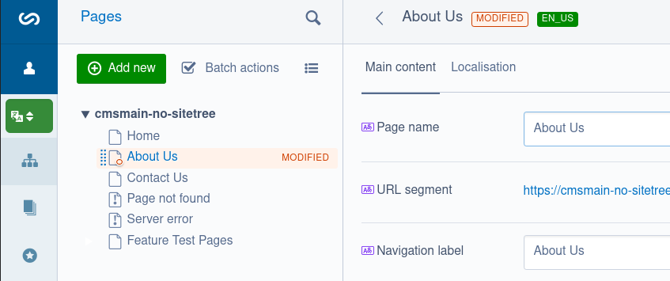
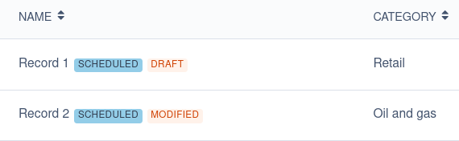

# Status flags

Status flags are short text descriptions of the status for a piece of content. For example, the [`Versioned`](api:SilverStripe\Versioned\Versioned) extension provides status flags to indicate when content in in draft or has been modified, so content authors know there is content that hasn't yet been published.

These flags are displayed at the top of edit forms in the CMS, and in various places next to record names such as the site tree and in grid fields.



In the above screenshot, "MODIFIED" and "EN_US" are status flags. The "MODIFIED" flag is provided by the `Versioned` extension, and the "EN_US" flag is provided by [`tractorcow/silverstripe-fluent`](https://github.com/tractorcow-farm/silverstripe-fluent/).

Note that in the site tree only one status flag will be displayed when you're editing a record, due to the limited space available.

Some status flags have additional context which can be viewed by hovering over them with your mouse cursor.

## Adding and removing status flags

You can easily add and remove status flags.

The customization of status flags can be done either directly in the model class by overriding the [`ModelData::getStatusFlags()`](api:SilverStripe\Model\ModelData::getStatusFlags()) method, or by [applying an extension](/developer_guides/extending/extensions/) that implements the `updateStatusFlags` extension hook.

Add status flags by adding new items to the `$flags` array, and remove existing flags by unsetting the relevant key in the array.

### Directly on the model

```php
namespace App\Model;

use SilverStripe\ORM\DataObject;

class Event extends DataObject
{
    // ...
    private static array $db = [
        'Scheduled' => 'Date',
    ];

    public function getStatusFlags(bool $cached = true): array
    {
        $this->beforeExtending('updateStatusFlags', function (array &$flags) {
            if ($this->dbObject('Scheduled')->InFuture()) {
                $flags['scheduled'] = 'Scheduled';
            }
        });
        return parent::getStatusFlags($cached);
    }
}
```

### Via an extension

```php
namespace App\Extension;

use SilverStripe\Core\Extension;

class ScheduleExtension extends Extension
{
    private static array $db = [
        'Scheduled' => 'Date',
    ];

    protected function updateStatusFlags(array &$flags): void
    {
        if ($this->getOwner()->dbObject('Scheduled')->InFuture()) {
            $flags['scheduled'] = 'Scheduled';
        }
    }
}
```

### Including additional context

Sometimes the text of a status flag won't convey all the information you want it to, since it is so short.

You can include additional context which will be displayed when hovering over your status flags. This is done using an associative array where the main text of the flag is in the `text` key, and the additional information is in the `title` key:

```php
namespace App\Model;

use SilverStripe\ORM\DataObject;

class Event extends DataObject
{
    // ...
    public function getStatusFlags(bool $cached = true): array
    {
        $this->beforeExtending('updateStatusFlags', function (array &$flags) {
            if ($this->dbObject('Scheduled')->InFuture()) {
                $flags['scheduled'] = [
                    'text' => 'Scheduled',
                    'title' => 'This event has been scheduled for a future date',
                ];
            }
        });
        return parent::getStatusFlags($cached);
    }
}
```

## Styling status flags

By default custom status flags will have a blue background and dark grey text.



If you want to customise how your status flags look, you can add some CSS to the CMS that targets the `badge` and `status-<flag-name>` CSS classes. For example the flag added above would have the CSS classes `badge status-scheduled`.

Status flags displayed in the top of an edit form (aka in the breadcrumbs) also have the CSS class `badge--breadcrumbs`, which allows a border to be displayed around the flag in that context.

See [include custom CSS in the CMS](/developer_guides/customising_the_admin_interface/how_tos/extend_cms_interface/#include-custom-css-in-the-cms) for more detailed instructions.

### Status flags in `GridField`

By default, if your [`GridField`](api:SilverStripe\Forms\GridField\GridField) includes a `Title` or `Name` column, that column will be used to display the status flags.

Depending on your requirements, you might want to hide status flags in a given grid field, or change what column is used to display them.

The [`GridFieldDataColumns`](api:SilverStripe\Forms\GridField\GridFieldDataColumns) component provides some methods you can use to control how and if status flags are displayed:

- [`setDisplayStatusFlags()`](api:SilverStripe\Forms\GridField\GridFieldDataColumns::setDisplayStatusFlags()): Pass `false` to stop displaying status flags for this grid field
- [`setColumnsForStatusFlag()`](api:SilverStripe\Forms\GridField\GridFieldDataColumns::setColumnsForStatusFlag()): Pass an array of column names. The first column found in this list will be used to display status flags.
